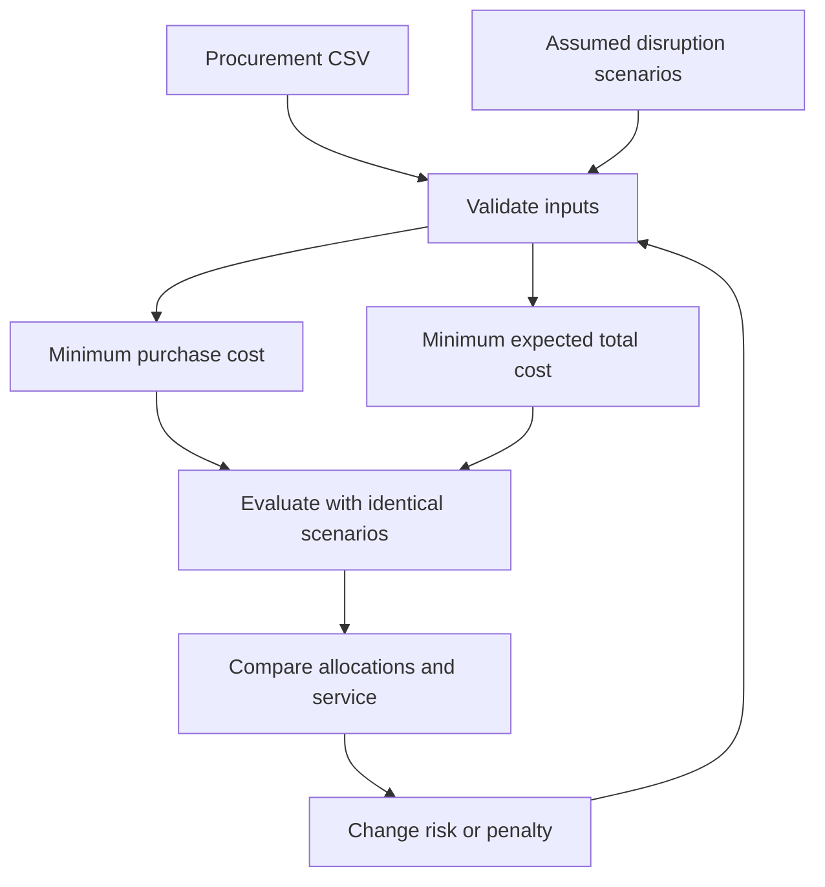

# SupplyShield · Sourcing Intelligence

**A decision workspace for the cost of reliability.**

SupplyShield is an interactive procurement decision workspace comparing three sourcing strategies: cost-first, expected-cost and tail-protected. Explore the price of reliability using transparent optimization and reproducible scenario experiments.


*Static preview generated from model outputs, not a screenshot of the live app.*

## Version 2 capabilities

| Workspace | What you can do |
|---|---|
| Allocation studio | Compare three plans, read a generated decision brief and inspect binding constraints |
| Scenario stress test | Inspect delivered units, shortages and scenario costs |
| Sensitivity lab | Reoptimize over 11 disruption probabilities and export results |
| Supplier workbench | Edit purchasing prices and ordering caps without changing source CSVs |
| Method & export | Download inputs, parameters, allocations, metrics and a decision brief as one ZIP |

**New strategy:** Tail-protected sourcing uses Conditional Value at Risk (CVaR)
to account for the average shortage cost in the worst probability tail. Adjust
confidence and tail weight; inspect the trade-off against expected cost. This is
an operations-research portfolio project, not a calibrated real-world risk predictor.

## Quick start

Requires Python 3.11 or 3.12. From the repository folder:

```bash
python -m venv .venv
# macOS / Linux
source .venv/bin/activate
# Windows PowerShell instead: .venv\Scripts\Activate.ps1
python -m pip install -r requirements.txt
python -m streamlit run app.py
```

Open the local URL displayed by Streamlit. No API keys are required. PuLP uses
CBC; the standard supported-platform wheel supplies the solver executable.

## What you can explore

- Baseline and risk-aware order quantities across five suppliers.
- Expected total cost, shortages, fill rate and order concentration (HHI).
- Scenario-level shortages and downloadable allocation CSV.
- Clear infeasibility messages when demand exceeds effective ordering capacity.



## Data and scope

The included CSVs preserve the uploaded five-supplier, six-scenario prototype.
Demand defaults to 1,740 units. Prices and ordering limits are adapted from
Hamdan & Cheaitou's published benchmark; risks are explicit assumptions.
The `capacity` column is an ordering-limit proxy, not measured factory capacity.
First-tier prices are used at all quantities; quantity discounts are not modeled.
Costs are illustrative monetary units (MU), not verified dollars.

`data/scenarios.csv` contains a reference `probability` column at q=0.25.
Runtime probabilities are recalculated using the dashboard's total disruption
probability and conditional `risk_share`. The Normal row's `None` label is
preserved with `keep_default_na=False` when loading the app.

All ordered units are paid for even if not delivered. No recovery procurement,
refunds or simultaneous failures appear in the default scenarios. The penalty is
an assumed business cost. This is a decision-support demonstration, not an
empirically calibrated forecasting model.

## Repository map

| Path | Purpose |
|---|---|
| `app.py` | Interactive dashboard |
| `data/` | Supplied procurement and scenario CSVs |
| `src/optimizer.py` | Continuous LPs and safe solver status handling |
| `src/evaluation.py` | Common scenario evaluation and metrics |
| `src/validation.py` | Schema, numeric and probability checks |
| `tests/test_optimizer.py` | Optimization invariants, invalid inputs and app smoke test |
| `docs/methodology.md` | Formulation, assumptions and data provenance |
| `docs/dashboard.png` | Default results preview |
| `.github/workflows/tests.yml` | GitHub Actions test workflow |

## Tests

```bash
python -m pytest -q
```

Checks cover feasibility, invalid data, probability normalization, zero-risk and
zero-penalty limits, objective/evaluation agreement, nonoptimal solver results,
and the dashboard's normal and infeasible paths.

## Reproduce the preview

Optional, for documentation only:

```bash
python -m pip install matplotlib
python -m docs.render_preview
```

## Model

The baseline minimizes purchasing spend. The expected-cost model minimizes spend
plus the expected shortage penalty. Both enforce exact total ordering, supplier
ordering caps and maximum order share. Detailed equations and caveats are in
[methodology](docs/methodology.md).

For this exact-order, fractional-delivery model, expected shortages are linear
in allocations. It is therefore interpretable as risk-adjusted unit-cost sourcing;
the expectation-only strategy does not establish a general diversification or tail-risk benefit. The new CVaR strategy explicitly prices tail exposure within the supplied scenarios.

## Publish to your GitHub account

Create an empty GitHub repository named `supplyshield`, then run:

```bash
git init
git add .
git commit -m "Initial SupplyShield release"
git branch -M main
git remote add origin https://github.com/YOUR_USERNAME/supplyshield.git
git push -u origin main
```

## Attribution and license

Code: [MIT](LICENSE). Third-party data retain their source terms.

Hamdan, S., & Cheaitou, A. (2017). Datasets for supplier selection and order
allocation with green criteria, all-unit quantity discounts and varying number
of suppliers. *Data in Brief, 13*, 444–452.
https://doi.org/10.1016/j.dib.2017.06.018

Changes: single-period fixed-price approximation, quantity-band endpoints used
as ordering caps, and synthetic disruption scenarios. This is not a replication
of the original paper's model.

## Upgrade an existing checkout

Replace the old flattened files with this repository layout. Keep `app.py` and
`requirements.txt` at the repository root, CSVs in `data/`, modules in `src/` and
tests in `tests/`. Do not upload all files into the root again. Remove the old
root-level optimizer/evaluation/validation/test files to avoid duplicate imports.
The old nested SupplyShield.zip has been removed from this release.

## Deploy on Streamlit Community Cloud

After pushing the repository, select the GitHub repository and `app.py` as the
entry point. Dependencies come from `requirements.txt`; no secrets are needed.
Preserve `.streamlit/config.toml` for the visual theme.

## Validation

21 tests pass in the build environment, including CVaR partial-tail arithmetic,
objective/evaluation agreement, zero-tail-weight equivalence, invalid inputs,
normal/infeasible UI paths, probability sweep and strategy switching.
PuLP is bounded below version 4 because this implementation uses its CBC API.
